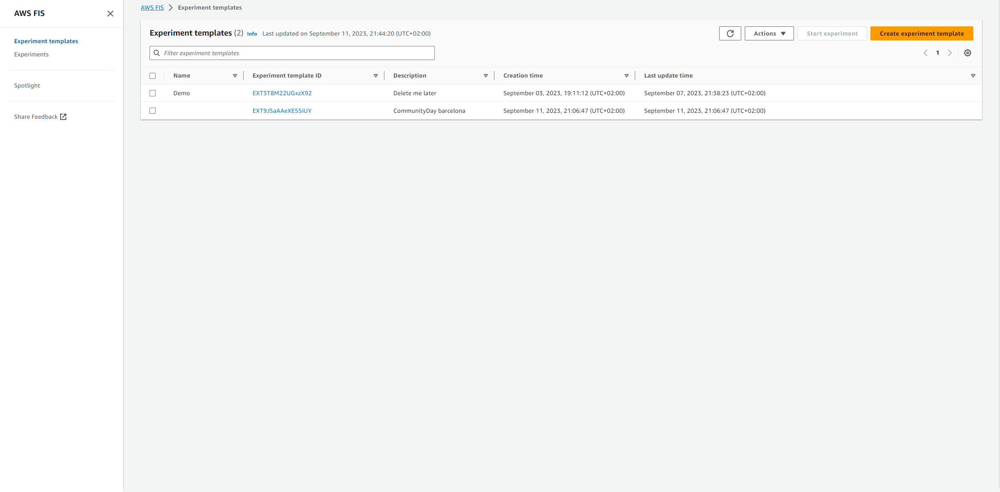
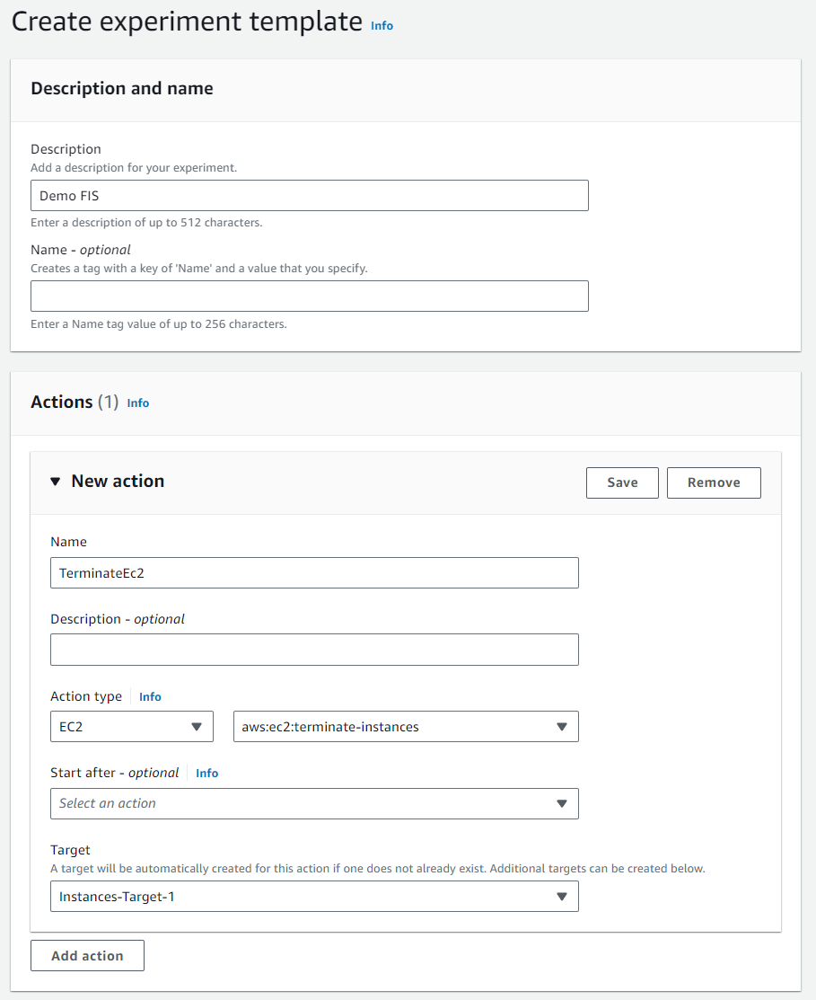
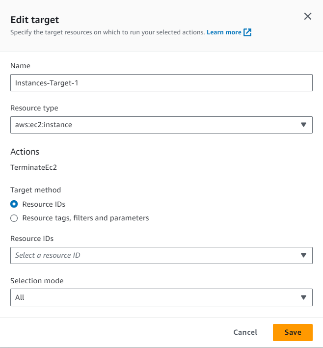
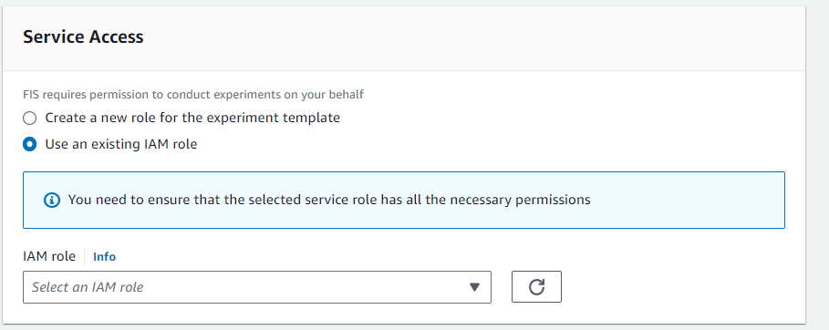

# AWS Fault Injectio Demo

This repo contains a demo of how to use AWS Fault Injection Simulator to test your application's resilience to failure.

## Prerequisites
- aws-cli
- aws-cdk


## Setup
1. Clone this repo
2. Make sure you have valid credentials and aws cli confgured
3. Run `cdk bootstrap` to create the necessary resources to deploy the CDK app
4. Run `cdk deploy` to deploy the CDK app

## Create a Fault Injection Experiment
1. Go to the AWS Console and navigate to the Fault Injection Simulator service

2. Click on Create Experiment


3. Add a description, select new action, give it a Name, Action type: EC2, and select type of action: aws:ec2:terminate-instances. Click save


4. Go to the target section, edit the target, and select the target type as EC2. Select the instance from your ECS cluster that you want to target. Click save


5. Go to the service access section. Select the IAM Role created by the CDK app. Click save


6. Click "Create experiment template" at the bottom of the page. You will get ask for confirmation.

7. Start the experiment by clicking on the "Start Experiment" button. You will get asked for confirmation.

## Run the Experiment
## Testing
Once the CDK gets deployed, it will output the Load Balancer DNS name. You can use this to test the application.

```
Outputs:
FisDemo.LoadBalancerDNS = http://FisDe-LB8A1-BNZFW5TDXWJV-1932086526.us-east-1.elb.amazonaws.com
Stack ARN:
arn:aws:cloudformation:us-east-1::stack/FisDemo/12235fd0-50cd-11ee-9ba0-120535d3a1e7
```

In the `fis` directory there is a script called `testEndpoint.sh` that you can use to test the application. You can run it like this:

```
./testEndpoint.sh http://FisDe-LB8A1-BNZFW5TDXWJV-1932086526.us-east-1.elb.amazonaws.com
```

You should see a response like this:

```
➜  infra git:(master) ✗ ./testEndpoint.sh http://FisDe-LB8A1-BNZFW5TDXWJV-1932086526.us-east-1.elb.amazonaws.com
Testing endpoint: http://FisDe-LB8A1-BNZFW5TDXWJV-1932086526.us-east-1.elb.amazonaws.com
Success - 200
Success - 200
Success - 200
Success - 200
Success - 200
Success - 200
Success - 200
Success - 200
Success - 200
Fail - 502
Success - 200
Fail - 502
Fail - 502
Success - 200
Success - 200
Fail - 504
Success - 200
Success - 200
Success - 200
Success - 200
Success - 200
Success - 200
Success - 200
Success - 200
Success - 200
Success - 200
Success - 200
Success - 200
Success - 200
Success - 200
Total requests: 30
Success rate: 86%
Fail rate: 13%
```

## Cleanup
Move to the `infra` directory and run `cdk destroy` to delete all the resources created by the CDK app.
